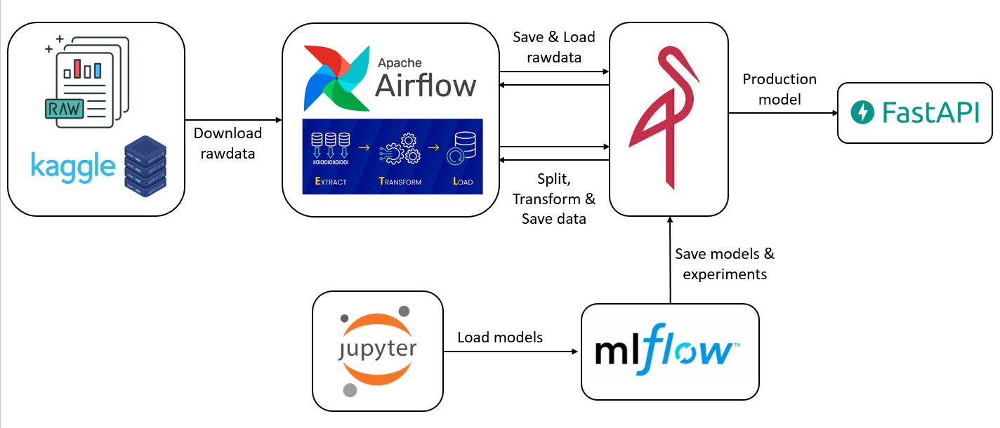

## Machine Learning Operations 1
## CEIA - FIUBA
## 1º Bimestre 2025

## Trabajo Práctico Final

### Grupo

| Autores               | E-mail                    | Nº SIU  |
|---------------------- |---------------------------|---------|
| Leonardo Centurión    | centurionm.leo@gmail.com  | a1803   |
| Braian Desía          | b.desia@hotmail.com       | a1804   |
| Juan José Cardinali   | juanchijc@gmail.com       | a1809   |

# Descripción

El presente servicio proporciona una predicción sobre si va a llover o no en diferentes ciudades de Australia para el día siguiente.

## Fuente

El dataset utilizado para el entrenamiento entrenamiento del modelo proviene de Kaggle. Se puede descargar el data set de este [link](https://www.kaggle.com/api/v1/datasets/download/jsphyg/weather-dataset-rattle-package)

# Componentes del proyecto

El presente proyecto involucra los siguientes servicios y herramientas:

1. **Apache Airflow**: Herramienta para programar, monitorear y administrar flujos de trabajo de datos. Se emplea para la descarga de set desde la fuente, dividir el set en train/test y pre-procesar los datos.
  - URL: http://localhost:8080
2. **MLflow**: Plataforma de código abierto para gestionar el ciclo de vida completo del aprendizaje automático. Se emplea para experimentanción y optimización de hiperparámetros.
  - URL: http://localhost:5001
3. **MinIO**: Servidor de almacenamiento de objetos de alto rendimiento y distribuido. Se emplea para guardar el dasaset crudo, su procesamiento a partir del flujo de Airflow y para guardar los resultados de los experimentos de MLFlow.
  - URL: http://localhost:9001
4. **FastAPI**: Endpoint de la API que sirve el modelo y realiza predicciones sobre datos nuevos.
  - URL: http://localhost:5000/



# Instalación

## Pre-requisitos

Asegurarse de tener instalados:
- Docker and Docker Compose
- Python 3.8+


## Service Access Details

### 1. Airflow
   - Description: Manages and monitors the ETL pipeline.
   - URL: [http://localhost:8083](http://localhost:8080)
   - Credentials:  
     - Username: `airflow`  
     - Password: `airflow`

### 2. MLflow
   - Description: Tracks experiments and logs datasets.
   - URL: [http://localhost:5006](http://localhost:5006)

### 3. MinIO
   - Description: Provides object storage for datasets and artifacts.
   - Console URL: [http://localhost:9009](http://localhost:9009)
   - Credentials:
     - Access Key: `minio`
     - Secret Key: `minio123`

### 4. FastAPI
   - Description: Exposes API endpoints for predictions and dataset handling.
   - URL: [http://localhost:8803/docs#/](http://localhost:8803/docs#/)

### 5. Streamlit
   - Description: Interactive dashboard for exploring data and results.
   - URL: [http://localhost:8504](http://localhost:8504)

---

## Workflow Overview

### Steps in the ETL Pipeline:
1. Data Ingestion: 
   - Downloads the dataset from Google Drive.
   - Stores it in an S3 bucket using MinIO.
2. Feature Engineering:
   - Scales numerical features (`duration`, `tempo`, `loudness`) using `MinMaxScaler`.
   - Retains key features for modeling (`speechiness`, `energy`, `danceability`, `acousticness`).
   - Stores the processed dataset back into MinIO.
3. Dataset Splitting:
   - Splits the dataset into training and testing sets (70/30 split) using stratified sampling.
   - Saves the split datasets in S3.
4. Dataset Registration:
   - Logs dataset metadata and statistics (mean, standard deviation) to S3 and MLflow.

---

## Running the Project

### Step 1: Start the Services
Run the following command to start all services using Docker Compose:

```bash
docker compose --profile all up
```

