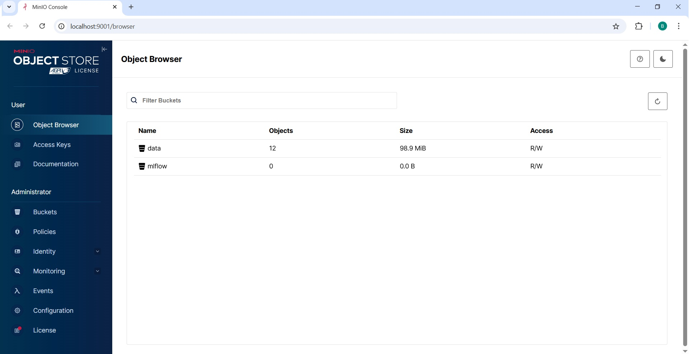
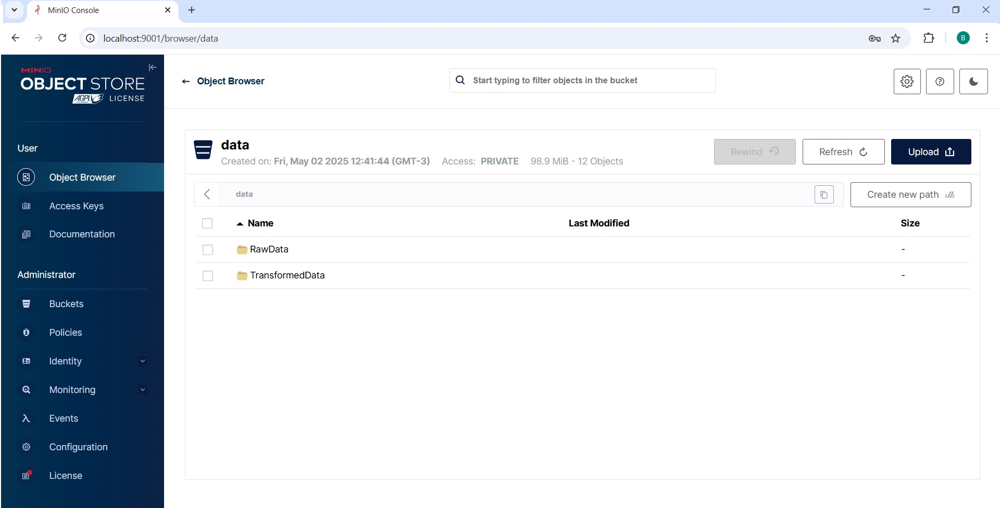
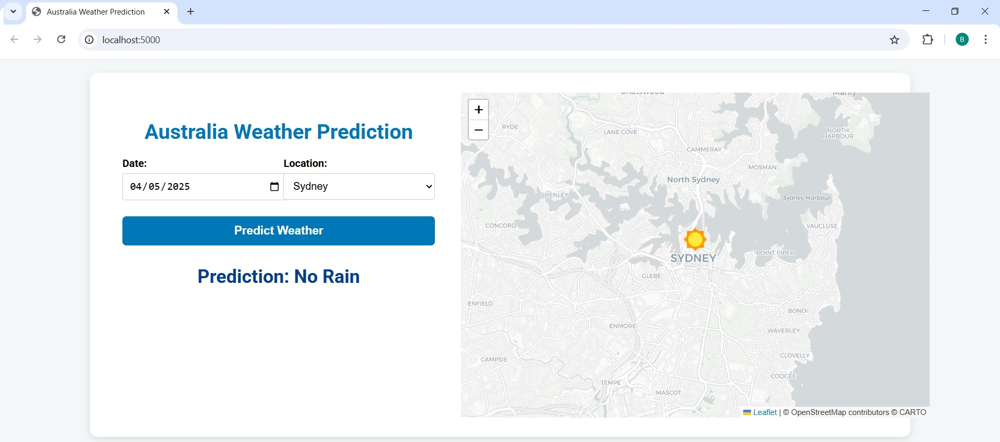
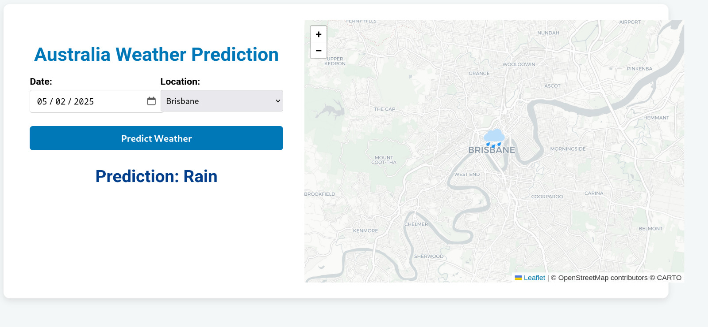
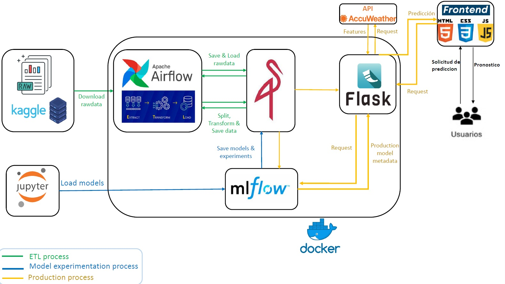
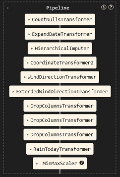

## Machine Learning Operations 1
## CEIA - FIUBA
## 1º Bimestre 2025

## Trabajo Práctico Final

### Grupo

| Autores               | E-mail                    | Nº SIU  |
|---------------------- |---------------------------|---------|
| Leonardo Centurión    | centurionm.leo@gmail.com  | a1803   |
| Braian Desía          | b.desia@hotmail.com       | a1804   |
| Juan José Cardinali   | juanchijc@gmail.com       | a1809   |

---
# **RAIN IN AUSTRALIA**: an AI solution for tomorrow rain prediction


## Descripción

El presente servicio representan una solución basada en AI para una predicción confiable sobre si va a llover o no en diferentes ciudades de Australia para el día siguiente. El usuario deberá simplemente seleccionar la ciudad para que el servicio pueda realizar la prognosis para el día siguiente.

## Fuente

El dataset utilizado para el entrenamiento y testeo del modelo proviene de Kaggle. El mismo comprende cerca de 10 años de observaciones de variables climáticas en diferentes localizaciones de Australia. Se puede descargar de este [link](https://www.kaggle.com/api/v1/datasets/download/jsphyg/weather-dataset-rattle-package).

Para nuevas predicciones, no hace falta más que indicar la ciudad en la cual se quiere conocer la predicción, el resto de los atributos, tales como temperatura del día previo, velocidad del viento, presión, etc., se toman directamente de la API de [AccuWeather](https://www.accuweather.com) cuando se utiliza el servicio desde la página web.

## Componentes del proyecto

El presente proyecto involucra los siguientes servicios y herramientas:

1. **Apache Airflow**
   - <ins>Descripción:</ins> Herramienta para programar, monitorear y administrar flujos de trabajo de datos. 
   - <ins>Uso:</ins> Descarga de set desde la fuente, dividir el set en train/test y pre-procesar los datos. Cargar el modelo entrenado a MLflow.


2. **MLflow**: 
   - <ins>Descripción:</ins> Plataforma de código abierto para gestionar el ciclo de vida completo del aprendizaje automático, incluyendo experimentos, reproducibilidad y despliegue de modelos. 
   - <ins>Uso:</ins> Experimentanción y optimización de hiperparámetros. Catalogación de modelos.


3. **MinIO**: 
   - <ins>Descripción:</ins> Servidor de almacenamiento de objetos compatible con S3, optimizada para escalabilidad, rendimiento y uso en entornos de nube y local.
   - <ins>Uso:</ins> Almacenamiento del dasaset crudo, dataset pre-procesado por Airflow y artefactos de MLflow.






4. **Flask**:
   - <ins>Descripción:</ins> Framework para servcios HTTP.
   - <ins>Uso:</ins> Disponibilizar el modelo a través de la REST-API y para servir la página web desde donde los usuarios consumen el servicio.





### Diagrama de interacción



1. **ETL Process**

   - Flujo de trabajo:

   `get_rawdata` >> `get_coords_by_loc` >> `split_dataset` >> `prepo_pipeline` 

      1. `get_rawdata`: Descarga de datos crudos.

      Esta tarea descarga los datos de lluvia desde Kaggle y los guarda en un bucket de S3 para su posterior procesamiento.

      2. `get_coords_by_loc`: Obtención de coordenadas por ubicación.

      Esta tarea lee los datos crudos en S3, extrae las ubicaciones únicas y obtiene sus coordenadas geográficas (latitud y longitud) usando una función auxiliar. Luego, guarda un archivo CSV con las coordenadas de cada ubicación en S3. Estos datos son necesario para el pipeline de pre-procesamiento.

      3. `split_dataset`: División del conjunto de datos en entrenamiento y prueba.

      Esta tarea carga el dataset y lo segmenta en conjuntos de entrenamiento y test, manteniendo las proporciones de las clases. Los conjuntos se guardan en S3 para su uso posterior.

      4. `prepo_pipeline`: Preprocesamiento avanzado y transformación de los datos.

      Esta tarea recupera los conjuntos de entrenamiento y prueba, aplica una serie de transformaciones y limpieza de datos mediante una pipeline personalizada, y guarda los datos transformados en S3. También guarda el pipeline entrenado en un archivo pickle para usos futuros.

      A continuación se describe el pipeline de preprocesamiento:

      Se define el siguiente diagrama de trabajo para pre-procesamiento de datos:

            1. Agrega nueva columna con la cantidad de nulos por instancia.

            2. Extraer mes de la instancia: Permite evaluar las variables por estacionalidad.

            3. Imputación jerárquica de *missings*:
               - Para variable numérica:
                  - Si la variable es NaN, toma la media en ese mes en esa ciudad.
                  - Si continua NaN, toma la media del mes en todas las ciudades.
                  - Si continua NaN, toma la media del dataset.

               -   Para variables categóricas:
                  - Idem a numéricas pero usando la moda en lugar de la media.

            4. Convertir variable categórica `Location`a variables numéricas `Latitude` y `Longitude`.

            5. Convertir variables categóricas de dirección cardinal de viento a numérica expresada en ºDEG. Por ej., N -> 0º, NE -> 45º, ...

            6. Convertir variable numérica en ºDEG de dirección del viento a cos y sin. Por ej., NE -> 45º -> (0.707, 0.707) ...

            7. Eliminar columnas categóricas reemplazadas por numéricas.

            8. Eliminar columna numérica de dirección del viento en ºDEG.

            9. Convertir variable binaria `RainToday` a numérica Yes/No -> 1, 0 y agregar variable binaria si 'RainToday' es nulo o no (1/0).

            10. Escalar las variables entre 0 y 1.




2. Model Experimentation Process
   
   - Se define un modelo XGBoost Classifier y se lleva a cabo una búsqueda de hiper-párámetros usando GridSearch, utilizando el *accuracy* como métrica de evaluación. Se guarda el mejor modelo.

   - Se entre al mejor modelo que resulto del paso anterior.

3. Production Process
   
   - El usuario hace una solicitud en el front-end estableciendo una ciudad de Australia. El front-end la manda a la API.
   
   - La API, por un lado, solicita a la API de AccuWeather por datos requeridos por el modelo en día y ciudad requerida, tales como temperatura, presión, velocidad del viento, etc. Por otra parte, la API solicita a MLflow el mejor modelo.
   
   - Con los features de AccuWeather y el mejor modelo de MLflow, hace la predicción y la devuelve al front-end.

## Corriendo el servicio

### Pre-requisitos de instalación

Para clonar el repositorio del servicio y control de versiones:
- Git

Para correr el servicio, asegurarse de tener instalado:
- Docker and Docker Compose

Adicional para levantar y correr Notebooks:
- Python 3.8+
- Poetry
- Pycharm, VScode o algún otro framework que soporte Jupyter Notebooks.


### Step 0: Clonar repositorio.

Descargar repositorio directamente desde la página web de github o correr el siguiente comando para clonar:

```bash
git clone https://github.com/LeoCenturion/ceia-mlops.git
```

Para la segunda opción, resulta necesario tener descargado e instalado git.

### Step 1: Inicializar el servicio
En la carpeta raíz de este repositorio, correr el siguiente comando para inicializar el servicio completo utilizando Docker Compose:

```bash
docker compose --profile all up
```

Importante para Windows: Asegurarse de tener Docker Desktop ejecutándose.

Para asegurarte de que todos los servicios estén en estado *healthy*, revisa en Docker Desktop o escribe el comando:

```bash
docker ps -a
```

Para acceder a los servicios disponibles, utilizar puertos y credenciales de acceso descriptas a continuación:


#### Detalles de acceso

#### 1. Airflow
   - <ins>URL:</ins> http://localhost:8080
   - <ins>Credenciales:</ins>  
     - Username: `airflow`  
     - Password: `airflow`

#### 2. MLflow
   - <ins>URL:</ins> http://localhost:5001


#### 3. MinIO
   - <ins>URL:</ins> http://localhost:9001
   - <ins>Credenciales:</ins>  
     - Access Key: `minio`
     - Secret Key: `minio123`

#### 4. Flask: Rain Predictor Service
   - <ins>URL:</ins> http://localhost:5000


### Step 2: ETL Process

En Apache Airflow, ejecuta el ETL haciendo clic en el botón de "play". Esperar hasta que se complete.

Una vez finalizado, se deberían visualizar los archivos en MinIO.

### Step 3: Production model load Process

COMPLETAR CON LEO


### Step 4: Rain predictor

¡Ya puedes hacer planes para mañana! Entra en la API, selecciona la ciudad, y haz clic en "Predict Weather".